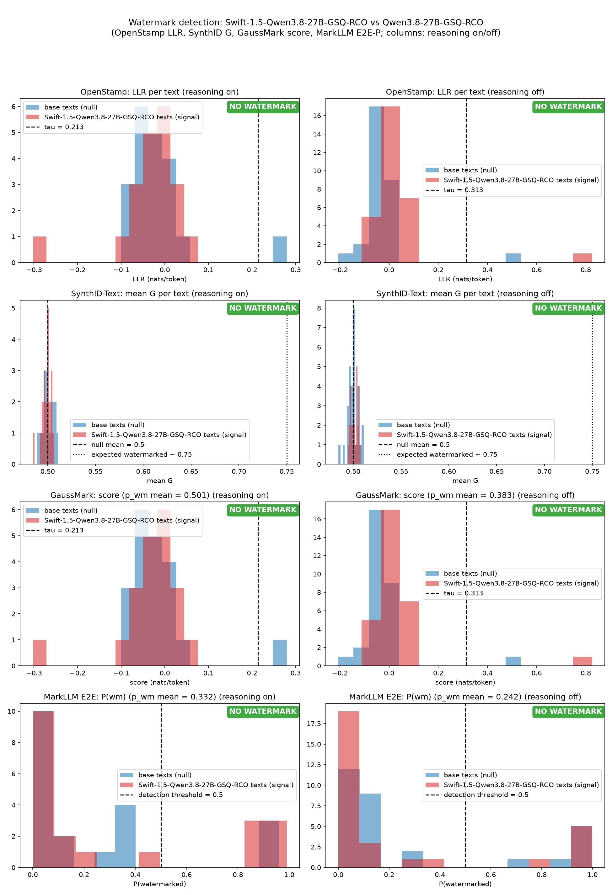
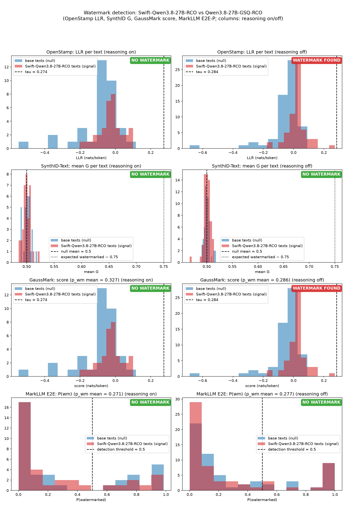
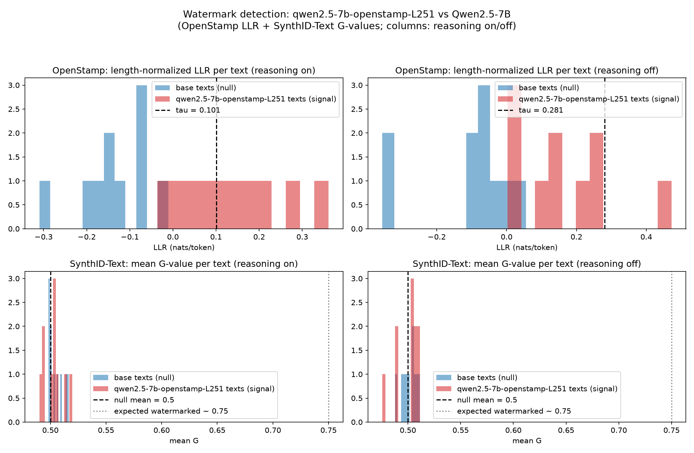

# watermark-llm-check

Утилита детекции watermark в выводе LLM. Сравнивает две модели, сервируемые
через llama.cpp, и отвечает на вопрос: есть ли watermark в выводе
watermarked-кандидата.

Четыре независимых детектора, по публичным референс-реализациям
(git-сабмодули проекта):

- **OpenStamp** (`openstamp/METHOD.md`) — length-normalized log-likelihood
  ratio между watermarked и базовой моделями, ключ не нужен:
  $LLR(x) = \frac{1}{T-1}\sum_{t=1}^{T-1}\log\frac{p_{\text{wm}}(x_t \mid x_{<t})}{p_{\text{base}}(x_t \mid x_{<t})}$.
- **SynthID-Text** (`synthid-text/`, Apache-2.0) — keyed-hash G-значения
  (ngram_len=5, 30 ключей, context_history_size=1024 из
  `DEFAULT_WATERMARKING_CONFIG`), training-free weighted-mean детектор.
  Null G = 0.5 (Bernoulli-биты); у watermarked-текста смещается вверх
  (~0.75).
- **GaussMark** (`gaussmark/`, ключевая версия) — структурный
  watermark (гауссов шум в весах). Статистика бумаги
  `score(T) = <grad_base(T), W>` (W — шум-ключ) без ключа
  считается по тождеству первого порядка
  `<grad_base(T), dtheta> ~ L_wm(T) − L_base(T)`, dtheta —
  наблюдаемая разность весов; p-value — нормальный тест
  (null — тексты базовой модели).
- **MarkLLM** (`markllm/`, E2E-LLM-Watermark) — нейронный
  детектор (LSTM по эмбеддингам opt-1.3b), ключ не нужен:
  `P(watermarked)` на текст. Checkpoint `models/e2e-35000.pth`
  (SHA-256 в `markllm/watermark/e2e/README.md`), эмбеддинги —
  `models/opt-1.3b-embeddings.pt`.

## Структура

```
detect.py      # main: сервер, генерация, скоринг, анализ, отчёт
test_llr.py    # эквивалентность по-токенного LLR и openstamp/src/llr.py
smoke.py       # ручной smoke-тест сервера (thinking + grammar-score)
status.py      # статус прогона по data_*.json
openstamp/     # сабмодуль: референс OpenStamp (METHOD.md, src/llr.py)
synthid-text/  # сабмодуль: референс SynthID-Text (модули)
gaussmark/     # сабмодуль: референс GaussMark (метод, p-value)
markllm/       # сабмодуль: E2E-LLM-Watermark (LSTM-детектор)
models/        # e2e-35000.pth (checkpoint E2E) и opt-1.3b-embeddings.pt
data/          # data_<модель>_<квант>.json, report_<модель>_<квант>.json и
               # watermark_report_<модель>_<квант>.png — в git;
               # wm_*/base_*.txt и server_*.log — нет
```

## Установка

```
git clone --recursive <url>
cd watermark-llm-check
pip install -r requirements.txt   # numpy, requests, torch, matplotlib, transformers
```

В `models/` нужны два файла (не в git):
- `models/e2e-35000.pth` — checkpoint E2E-детектора (SHA-256 в
  `markllm/watermark/e2e/README.md`);
- `models/opt-1.3b-embeddings.pt` — эмбеддинги `facebook/opt-1.3b`
  (token id -> вектор).

## Запуск

```
python3 detect.py --models-dir /path/to/gguf          # полный прогон
python3 detect.py --resume                             # доскорить недостающие L
python3 detect.py --analyze-only                       # только анализ + график
python3 status.py                                      # статус прогона
```

Полезные флаги (`--help` для списка): `--wm-gguf/--base-gguf` (файлы в
`--models-dir`), `--wm-model/--base-model` (имена в отчёте), `--quant`
(квантизация в именах отчёта; по умолчанию — из имени wm-GGUF), `--llama-bin`
(бинарь llama-server), `--device` (например `cuda0`, `ROCm1`, `cpu`),
`--prompts` (по умолчанию 60), `--tokens` (по умолчанию 400).

## Прогон

1. **Генерация** — N текстов (по умолчанию 60) в двух режимах
   (reasoning on/off); в VRAM одна модель за раз, сервер
   перезапускается со второй моделью;
2. **Скоринг** — L = Σ log p(x_t|x_<t>) для полной 2×2-матрицы
   (тексты × модели) через GBNF-грамматики (pre-sampling logprobs);
   пустые тексты (зацикливание на спец-токенах) исключаются из анализа;
3. **Анализ** — 4 детектора, отчёт, график. Вердикт — спаренный
   t-критерий по разностям (signal − null) на общих промптах:
   t ≥ 3 и большинство разностей положительные.

## Результат

- `data/watermark_report_<модель>_<квант>.png` — 4×2-график
  (LLR, mean G, GaussMark-score, E2E-P; columns: reasoning on/off);
  в каждой панели — отметка-вердикт (`WATERMARK FOUND` / `NO WATERMARK`);
- `data/report_<модель>_<квант>.json` — все числа (поле `plot` — относительное имя);
- в stdout — отчёт с вердиктом по каждому детектору.

| Прогон | wm (кандидат) | base | Квант | OpenStamp (LLR) | SynthID (G) | GaussMark | MarkLLM E2E (P) | Вердикт |
|---|---|---|---|---|---|---|---|---|
| [`report_Swift-1.5-Qwen3.8-27B-GSQ-RCO_IQ3_S.json`](data/report_Swift-1.5-Qwen3.8-27B-GSQ-RCO_IQ3_S.json) | Swift-1.5-Qwen3.8-27B-GSQ-RCO | Qwen3.8-27B-GSQ-RCO | IQ3_S | +0.28 / +2.89 (n = 38/60) | −0.91 / +1.59 | +0.28 / +2.89 | +2.28 / −1.08 | **watermark не обнаружен** |
| [`report_qwen2.5-7b-openstamp-L251_Q8_0.json`](data/report_qwen2.5-7b-openstamp-L251_Q8_0.json) | qwen2.5-7b-openstamp-L251 | Qwen2.5-7B | Q8_0 | +13.72 / +9.80 (n = 60) | −0.62 / +0.51 | +13.72 / +9.80 (p<0.05: 50/60, 15/60) | −0.01 / +0.19 | **watermark обнаружен** (OpenStamp + GaussMark) |
| [`report_Swift-Qwen3.8-27B-RCO_IQ3_S.json`](data/report_Swift-Qwen3.8-27B-RCO_IQ3_S.json) | Swift-Qwen3.8-27B-RCO | Qwen3.8-27B-GSQ-RCO | IQ3_S | +2.88 / +3.56 | −0.71 / +0.43 | +2.88 / +3.56 | −0.71 / −0.61 | **watermark не обнаружен** (2/4 в noreason — неоднозначно) |

Значения в столбцах — t-сводка (спаренный t-критерий): reasoning on / reasoning off.

| Swift-1.5-Qwen3.8-27B-GSQ-RCO vs Qwen3.8-27B-GSQ-RCO (IQ3_S) | Swift-Qwen3.8-27B-RCO vs Qwen3.8-27B-GSQ-RCO (IQ3_S) | qwen2.5-7b-openstamp-L251 vs Qwen2.5-7B (Q8_0) |
|---|---|---|
| [](data/watermark_report_Swift-1.5-Qwen3.8-27B-GSQ-RCO_IQ3_S.png) | [](data/watermark_report_Swift-Qwen3.8-27B-RCO_IQ3_S.png) | [](data/watermark_report_qwen2.5-7b-openstamp-L251_Q8_0.png) |

- **27B-прогон GSQ** (60 промптов × 2 режима; в reason исключено 31
  текстов с пустым выходом → n = 38): ни один детектор вердикт не
  выдал — максимум t = +2.89 (LLR/GaussMark, noreason), ниже порога 3;
  LLR и G-значения Swift-1.5 и Qwen3.8-27B неотличимы (G ≈ 0.50 с
  обеих сторон, смещения выше бернулли-нуля нет).
- **27B-прогон RCO** (60 промптов × 2 режима; в reason исключено 25
  текстов с пустым выходом): в reasoning off два детектора
  (OpenStamp + GaussMark — одна и та же статистика первого порядка)
  дают t = +3.56, в reasoning on — нет (t = +2.88 < 3). SynthID и
  MarkLLM E2E не реагируют (G ≈ 0.50; E2E P ≈ 0.28 с обеих сторон).
- **7B-прогон** (60 промптов × 2 режима) — позитивный контроль: модель
  явно watermarked OpenStamp (delta=1.0, L=251). OpenStamp и
  GaussMark обнаруживают watermark в обоих режимах (t = +13.72 /
  +9.80, почти все разности положительные; GaussMark: 50/60 текстов
  с p < 0.05 в reason). SynthID (дефолтный ключ) и MarkLLM E2E — нет,
  что согласуется с тем, что watermark в этой модели — не SynthID,
  а E2E-детектор обучен на иных схемах (KGW/UNW на opt-1.3b).

## Лицензия

MIT (см. `LICENSE`). Референс-репозитории — под их собственными
лицензиями (Apache-2.0 для synthid-text).
